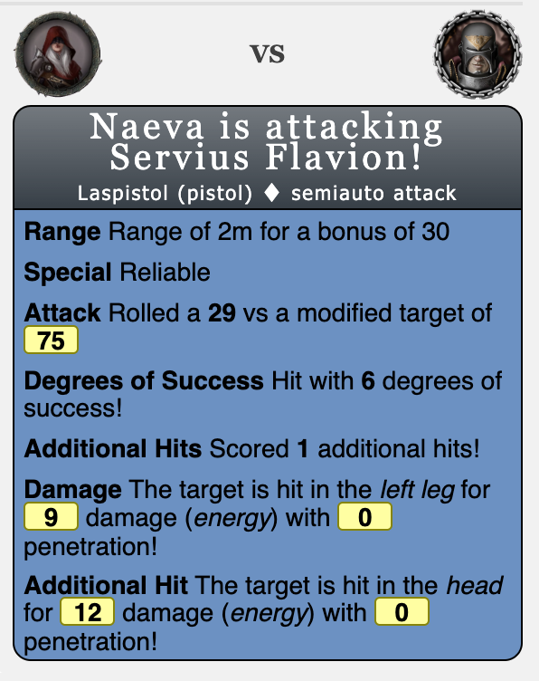
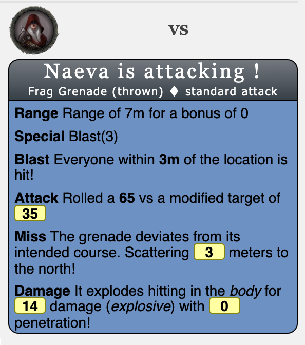
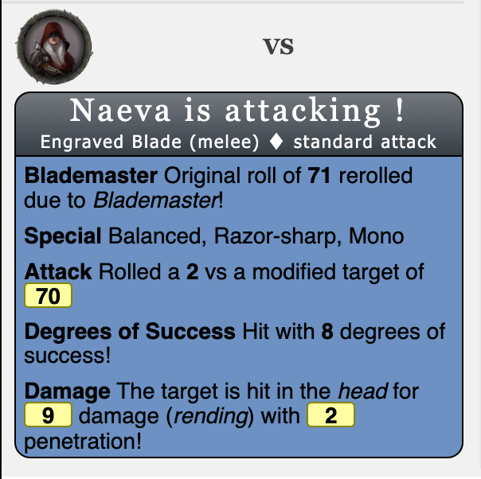
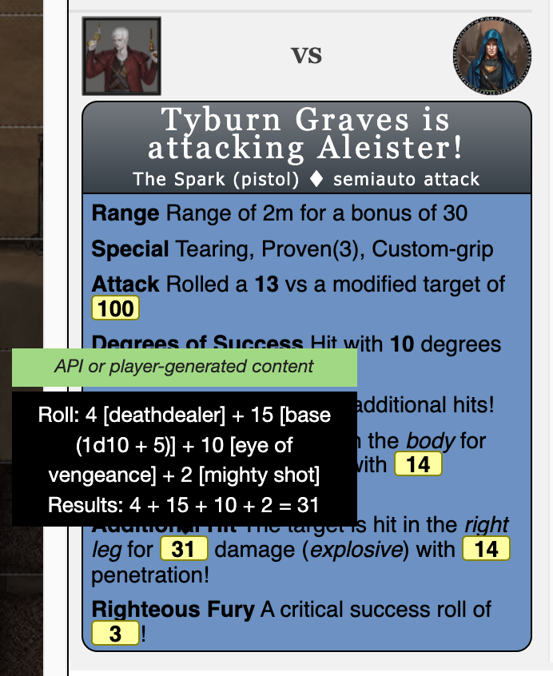
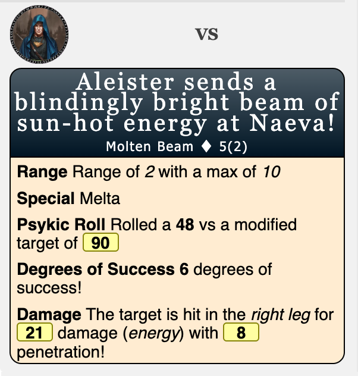
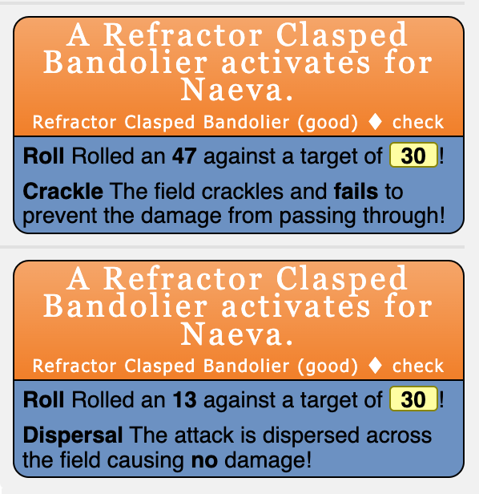

# Dark Heresy 2nd Edition - Roll20 Scripts

This is an _unofficial_ set of scripts to automate certain combat actions to streamline gameplay. It is not feature complete in the sense that there are missing talents and weapons. 

***WARNING***: This is sure to contain bugs and be incomplete since it's mostly catered to my own group. But I would be happy to add talents, weapons, psykana that others would be interested in. It might just take a bit.

## Installation

All scripts within the `src` directory should be added to Roll20. It is very possible that some of them have already been installed. I have no guarantees that other versions work but it is worth a try.

This works with the "Dark Heresy: 2nd Edition (Advanced API)" Character Sheet. I have a custom version that I might put up later that is compatible. 

## Usage

The general usage follows the approach of the Power Cards script written by Sky and Kurt Jaegers. It involves creating a macro that calls the !dh_2nd command followed by a series of arguments within {{ }}.

An example of a macro that selects the target and attacks with a Laspistol:

```
!dh_2nd {{
--source|@{selected|token_id}
--target|@{target|token_id}
--weapon|Laspistol
--action|weapon
--attack_type|?{Attack Type|standard|semiauto}
--aim|?{Aim|none|half|full}
--use_ammo|false
}}
```


### Arguments

- source: This is followed by a token id. The macro should be set to show as a token action with the source flag is used.
- character_id: An alternative to source that uses a character id without selecting a token.
- target: An optional field that is used to calculate range bonuses. Otherwise, the range can be passed using the range argument.
- weapon: The name of a weapon in the dh_weapon_db.js file. This pulls the stats for the weapon for the attack.
- additional_damage: Quick modifier to add an extra damage line in the output card and append to damage rolls.
- eye_of_vengeance: True if a fate is being used for the Eye of Vengeance talent.
- weaponreplace: This is followed with the desired key on the weapon to replace, a '|' character, and then the replacement. Multiple changes can be handled with the ';' character.
  - Example: `--weaponreplace|name|The Spark` -- This would replace the name field with a custom name for the weapon.
  - Example2: `--weaponreplace|penetration|6` -- This would replace the penetration of the weapon with 6.
- specialreplace: This is followed with the desired special name, a '|' character, and then the desired value. Multiple changes can be handled with the ';' character.
  - Example: `--specialreplace|proven|3;custom-grip|true` -- This would add or replace the 'proven' quality to '3' and enable the 'custom-grip' special.
  - Example2: `--specialreplace|tearing|false` -- Disables the tearing quality if it already exists on the weapon.
- use-ammo: Followed with a true or false on whether to use the ammo.js script. This defaults to false. Be careful as a true value causes the script to not work if the character does not have the weapon.
- ammo: This is followed with the name of an ammo within the dh_ammo_db.js file. This modifies the weapon stats as specified.
- gear: This is the gear within the dh_gear_db.js to use for gear actions. This is really only force fields at the moment.
- gearreplace: This is followed with the desired key on the gear to replace, a '|' character, and then the replacement. Multiple changes can be handled with the ';' character.
  - Example: `--gearreplace|name|Refractor Clasped Bandolier;quality|good` -- This would replace the name to 'Refractor Clasped Bandolier' and change the quality to 'good'.
- action: Which type of check is being made. Must either be: 'weapon', 'psykana', or 'gear'.
- gear_action: If action is gear, which type of gear action is being performed. Can be: 'activate', 'deactivate', or 'check'.

### Examples

#### Custom Force Field

Macro | Images
:---|:---:
Using a source token, target token, and a default laspistol. Attack type and aim are prompts on usage.<pre>!dh_2nd {{<br>--source\|@{selected\|token_id}<br>--target\|@{target\|token_id}<br>--weapon\|Laspistol<br>--action\|weapon<br>--attack_type\|?{Attack Type\|standard\|semiauto}<br>--aim\|?{Aim\|none\|half\|full}<br>}}</pre>|
Using a source token, no target, range entered on usage. Grenade with deviation. <pre>!dh_2nd {{<br>--source\|@{selected\|token_id}<br>--range\|?{Range\|5}<br>--weapon\|Frag Grenade<br>--action\|weapon<br>--attack_type\|standard<br>--aim\|?{Aim\|none\|half\|full}<br>}}|
User has Blademaster talent. Custom sword with a modified name, additional qualities, and some additional expected attack types. <pre>!dh_2nd {{<br>--source\|@{selected\|token_id}<br>--weapon\|Sword<br>--action\|weapon<br>--weaponreplace\|name\|Engraved Blade<br>--specialreplace\|razor-sharp\|true;mono\|true<br>--attack_type\|?{Attack Type\|standard\|swift\|all-out}<br>--aim\|?{Aim\|none\|half\|full}<br>}}</pre>|
User has Deathdealer, Mighty Shot, and using Eye of Vengeance talents. They rolled 10 degrees of success and had a Righteous Fury proc. <pre>!dh_2nd {{<br>--source\|@{selected\|token_id}<br>--target\|@{target\|token_id}<br>--weapon\|Bolt Pistol<br>--weaponreplace\|name\|The Spark<br>--specialreplace\|proven\|3;custom-grip\|true<br>--action\|weapon<br>--attack_type\|?{Attack Type\|standard\|semiauto}<br>--aim\|?{Aim\|none\|half\|full}<br>--eye_of_vengeance\|?{Eye of Vengeance\|false\|true}<br>}}</pre>|
A Psykana macro that includes known Psykana, target, and effective rating. <pre>!dh {{<br>--source\|@{selected\|token_id}<br>--target\|@{target\|token_id}<br>--psykana\|?{Psykana\|Assail\|Molten Beam\|Spontaneous Combustion}<br>--effective_rating\|?{Effective Rating\|1}<br>--action\|psykana<br>}}</pre>|
A custom named refractor field of good quality.<pre>!dh_2nd {{<br>--source\|@{selected\|token_id}<br>--gear\|Refractor Field<br>--gearreplace\|name\|Refractor Clasped Bandolier;quality\|good<br>--gear_action\|?{Action\|check\|activate\|deactivate}<br>}}</pre>|


### Supported Weapon Abilities
- accurate
- concussive
- concussive
- corrosive
- crippling
- custom-grip
- defensive
- flame
- graviton
- hallucinogenic
- haywire
- inaccurate
- indirect
- indirect
- melta
- mono
- overheats
- primitive
- proven
- razer-sharp
- red-dot
- reliable
- scatter
- snare
- telescopic-sight
- toxic
- twin-linked
- vengeful
- warp

### Supported Attack Types
- all-out
- barrage (this is for psykana)
- charge
- fullauto
- lightning
- maximal
- standard
- storm (this is for psykana)
- swift

### Supported Talents
- Blademaster
- Crushing Blow
- Deathdealer
- Eye of Vengeance
- Hammer Blow
- Inescapable Attack
- Mighty Shot
